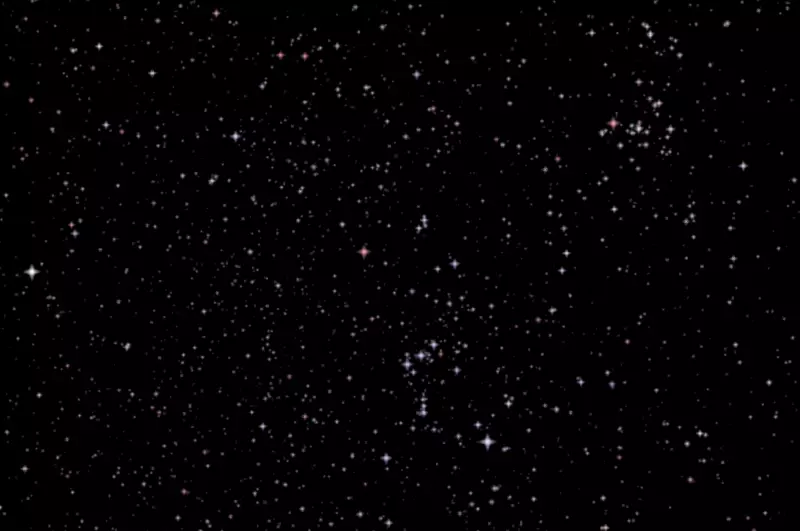

# Unity Star Renderer

This code is used to render a 3D star field into you scene using the [HYG star database](https://github.com/astronexus/HYG-Database).

In this animation you can see Orion and Pleiades as we fly along at 1 lightyear per second!

It is also simple to keep the sky rendered from a fixed vantage point. Whether that is from Earth/Sol or... Betelgeuse?

[WebGL demo available on simmer.io](https://simmer.io/@tjbaron/star-renderer)
