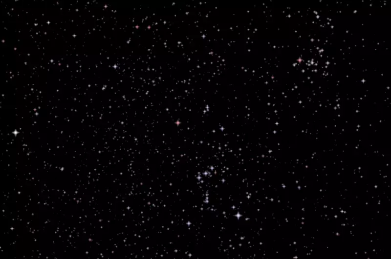

# Unity Star Renderer

This code is used to render a 3D star field into you scene using the [HYG star database](https://github.com/astronexus/HYG-Database).

In this animation you can see Orion and Pleiades as we fly along at 1 lightyear per second! While flying between stars

It is also simple to keep the sky rendered from a fixed vantage point. Whether that is from Earth/Sol or... Betelgeuse?

This package is only compatible with the Universal Render Pipeline (URP). Though it should be easy to port to the HDRP as well.

## Technical overview

Star size is tricky. It isn't based on distance, but relative magnitude (brightness). And relative magnitude varies depending
on you position in the starfield. With about 120,000 stars, and the goal of flying at any speed performance is key. Relative magnitude
is recalculated in the graphics shader for each star every frame. Then, based on this magnitude a star size is chosen. This sounds compute
intensive - and it would be on a CPU. But in a shader it runs amazingly fast.

Each star is rendered near the camera's far clip plane, so there's no worries of other scene objects rendering behind the stars.

Because you can fly as fast as you want through the whole starfield all ~120,000 stars need to be loaded up at all times. Even the dimmest
star will be bright if you're close enough to it! You'll be rendering around 240,000 very simple polygons separate into about 24 meshes. But
again, performance doesn't seem to be an issue - even if you're targeting a 500fps (something else in your game will likely be your bottleneck).

There are many small touches that make this star field look good. These include red/blue shift of each star (again using real data), and a subtle
twinkle. Later on these parameters could be made more configurable.

Unity Shader Graph is used to author the shaders. Was it easier than writing them in code? Nope - but hopefully it ends up being more maintainable
and easier for others to tweak.

## Usage for interstellar travel

Since this is a 3D starfield you can fly from star to star seamlessly. Your position is specified by the
"ViewerPosition" on the main "GenerateStars" Script. Position is relative to the sun (Sol) and is measured in Parsecs.

## Usage as a Skybox

If you plan to use this as a Skybox from the perspective of Earth's surface it is possible to specify a Latitude, Longitude,
Day of year (0-365) and time (0-24). The stars will rotate accordingly with +Z being north and +X being east. Based on simple
testing star positions seem to be withing 1-2 degrees of true value.

You'll also want to set "Viewer Position" to 0, 0, 0 (the position of our sun, Sol) and disable "Viewer to Camera Position" (so
you don't fly 1 parsec for every unit you move the camera).

## Demo

[WebGL demo available on simmer.io](https://simmer.io/@tjbaron/star-renderer)

## Adding to your project

### As a read only package

1. In Unity, got to "Window > Package Manager".
2. Click "+" and choose "Add package from git URL..."
3. Paste "https://github.com/tjbaron/unity-star-renderer.git" and press "Add"

Note: If you have trouble, ensure that both git and git-lfs are installed (on Mac this can be done via HomeBrew).

### As a git submodule

1. Ensure your project is already a git repo
2. Go to your projects root folder on command line
3. Run `git submodule add https://github.com/tjbaron/unity-star-renderer.git Packages/com.baroncreations.star-renderer`

You should now have the submodule added to the directory `Packages/com.baroncreations.star-renderer`

## Viewing the demo scenes

If you took the read only approach you will need to copy the example scenes to your "Assets" folder before opening:

1. In Unity "Projects" go to "Packages > Star Renderer > Samples"
2. Drag the scenes to the "Assets" folder to copy them over
3. Double click the scenes in you "Assets" folder to open
